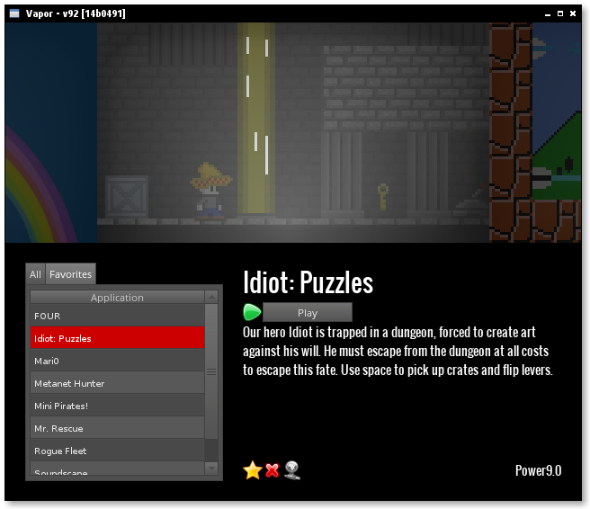

#Vapor - LÖVE Distribution Client

## Requirements

* LÖVE 0.8.0
* A stable internet connection.

## How can I add my game?

* Fork [this repo](https://github.com/josefnpat/vapor).
* Extend the `games.json` with the following data;

    **Make an [issue](https://github.com/josefnpat/vapor/issues) with all the following information from this step if you can't use git and json.**

    * id :      A unique id using only A-Z, a-z, underscores and dashes.
    * name :    The name of your game.
    * sources : An array of links to your .love files with an index representing the current unix timestamp.
                Please ensure that your game is hosted on an http server as opposed to https.
                If you can, please host this on a server, as opposed to a shared website like dropbox.
                Contact me if you would like me to host your .love file.
    * stable :  The timestamp of the current stable release index from your sources list.
                If you only have one element in sources, this would be that elements index.
    * author :  Your name or handle.
    * engine :  The engine that your game runs. Currently only supports `love-0.8.0`.
    * image :   A link to a PNG image 436x245 in dimension. The less text, the better.
                Please ensure that your image is hosted on an http server as opposed to https.
                Do not host this on a site that does not allow hotlinking.
                Sites like imgur.com should do well, but again, private hosts are best.
* Submit your pull request.
* Sit back and bask in the glory.

## Game Criteria

Your game must
* load and run,
* be playable,
* not start in fullscreen mode,
* use LÖVE 0.8.0,
* not use binary libraries not supplied by love (e.g. luasec).

## Your client sucks

_Yeah, what of it?_

Feature Requests, Suggestions, Bugs, etc. go in the [issue queue](https://github.com/josefnpat/vapor/issues).
